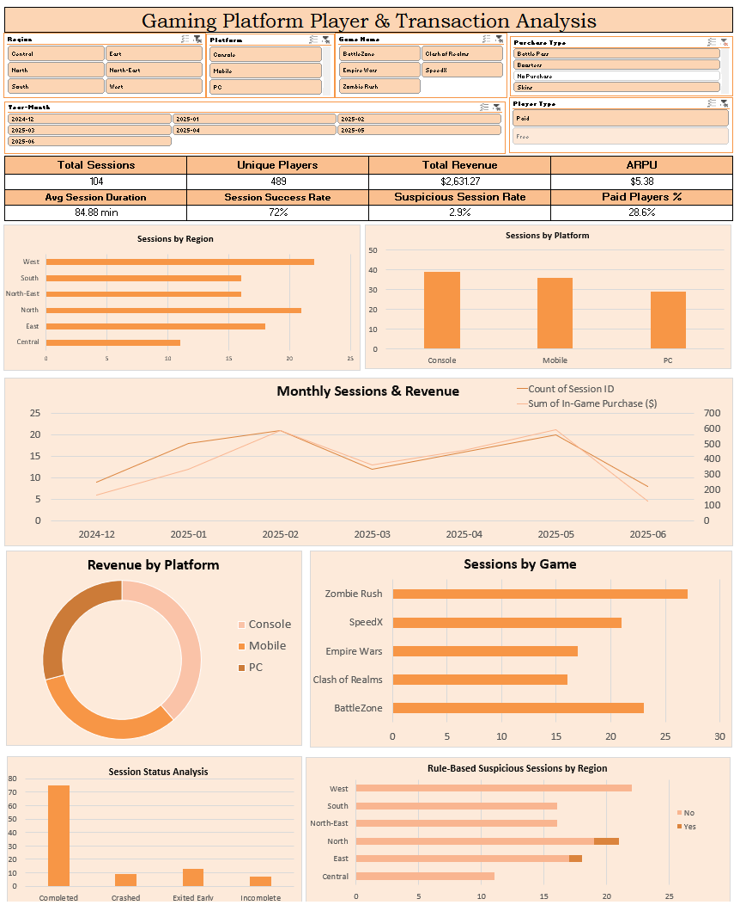
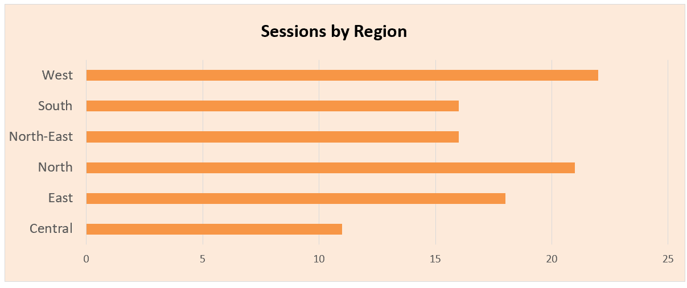
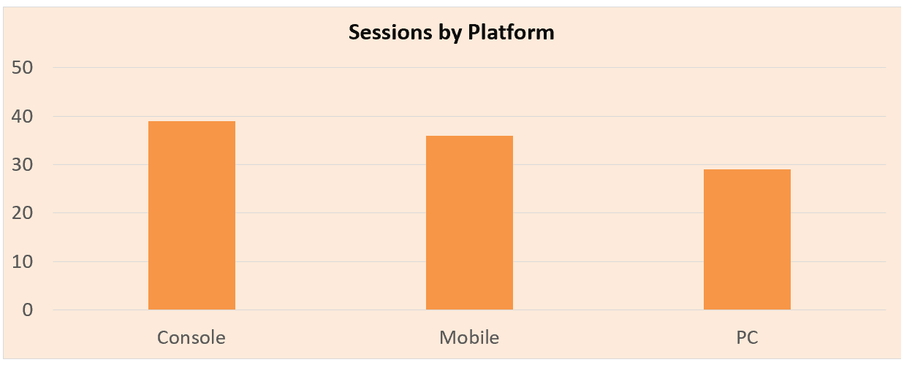
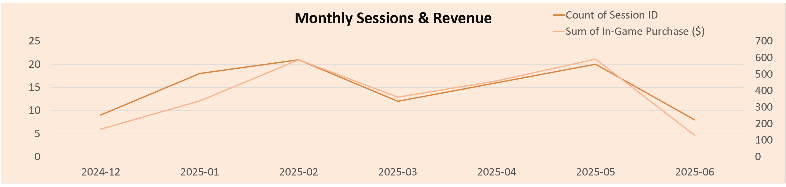
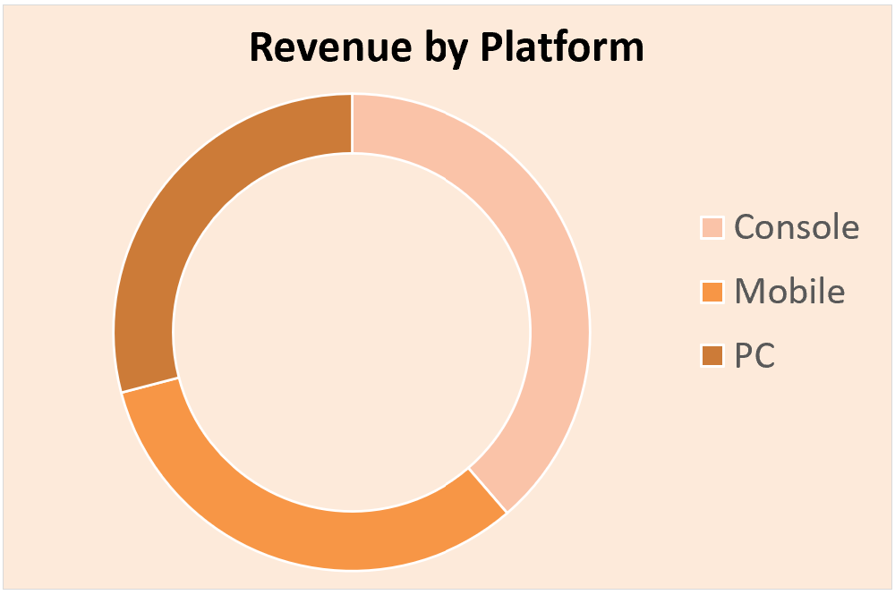
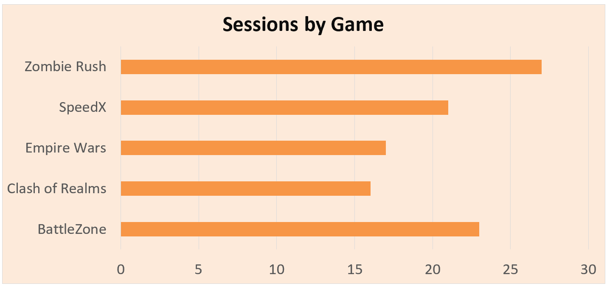
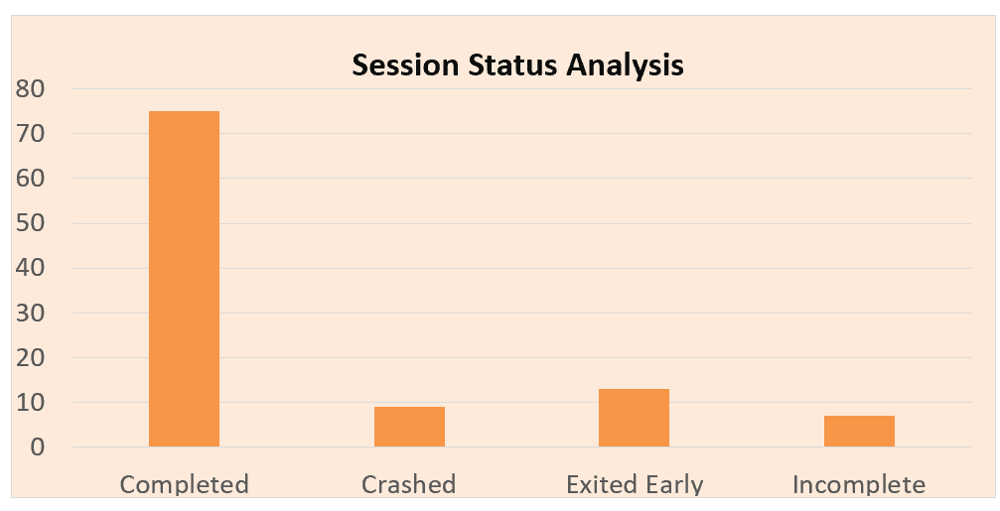
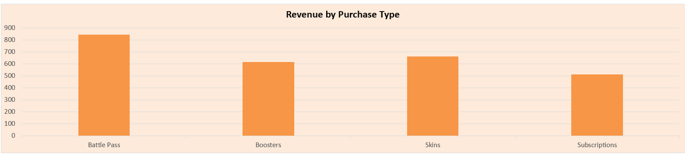

# 🎮 Gaming Platform Player & Transaction Analysis

An Excel-based data analytics project focused on understanding gaming player engagement, monetization, platform performance, regional activity, session outcomes, and suspicious activity.

The project uses Microsoft Excel for data cleaning, feature engineering, KPI development, PivotTable analysis, PivotCharts, and interactive dashboard creation.

---

## 📊 Interactive Dashboard

The interactive dashboard provides a consolidated view of player activity, revenue, engagement, platform performance, purchasing behavior, and session outcomes.

### Dashboard Features

- 8 KPI cards
- 8 analytical visualizations
- 6 interactive slicers
- PivotTables and PivotCharts
- Dynamic KPI analysis

### Interactive Filters

- Region
- Platform
- Game Name
- Purchase Type
- Player Type
- Year-Month

---

## 🎯 Project Objectives

The main objectives of this project were to:

- Analyze player engagement and gaming session activity
- Understand purchasing and monetization behavior
- Compare performance across gaming platforms
- Analyze game-level performance
- Identify regional differences in gameplay
- Evaluate session success and failure
- Examine suspicious gaming activity
- Build an interactive business intelligence dashboard
- Generate actionable business insights and recommendations

---

## 📁 Dataset

The dataset contains **500 gaming session records** and **14 original columns**.

### Dataset Fields

| Field | Description |
|---|---|
| Session ID | Unique gaming session identifier |
| Player ID | Player identifier |
| Player Name | Player name |
| Game Name | Name of the game |
| Platform | Gaming platform |
| Region | Player/session region |
| Session Date | Date and time of the session |
| Session Duration (min) | Duration of gameplay |
| In-Game Purchase ($) | Purchase amount |
| Purchase Type | Type of purchase |
| Session Status | Session completion status |
| Player Type | Free/Paid player classification |
| Level Reached | Level reached during the session |
| Is Suspicious | Existing suspicious-session indicator |

### Dataset Overview

- **Total Sessions:** 500
- **Unique Players:** 489
- **Date Range:** 13-Dec-2024 to 13-Jun-2025
- **Total Revenue:** $2,631.27

---

## 🧹 Data Cleaning & Preparation

The dataset was reviewed and prepared for analysis by checking:

- Duplicate Session IDs
- Missing values
- Numerical values
- Date formatting
- Categorical consistency
- Purchase-related values

The `Purchase Type` value `"None"` was standardized to **`No Purchase`** to make the category easier to analyze.

### Numerical Validation

| Field | Minimum | Maximum |
|---|---:|---:|
| Session Duration | 5 min | 180 min |
| In-Game Purchase | $0 | $47.72 |
| Level Reached | 1 | 50 |

No negative values were identified in these numerical fields.

---

## ⚙️ Feature Engineering

Several derived columns were created to support deeper analysis.
### Year-Month

| KPI | Value |
|---|---:|
| Total Sessions | **500** |
| Unique Players | **489** |
| Total Revenue | **$2,631.27** |
| ARPU | **$5.38** |
| Avg Session Duration | **90.64 min** |
| Session Success Rate | **72%** |
| Original Suspicious Session Rate | **20.6%** |
| Paid Players | **28.6%** |

### ARPU

ARPU was calculated as:

**Total Revenue / Unique Players**

$2,631.27 / 489 = **$5.38**

---

## 📊 Key Visualizations

### Sessions by Region

North recorded the highest session volume with **96 sessions**, while Central recorded **75 sessions**.

---

### Sessions by Platform

The dashboard compares gameplay volume across Console, Mobile, and PC.

---

### Monthly Sessions & Revenue

May 2025 recorded the highest session volume with **101 sessions** and the highest monthly revenue of **$590.20**.

> Note: June 2025 contains data only through 13 June and therefore represents a partial month.

---

### Revenue by Platform

Console generated the highest platform revenue at **$1,017.64**, followed by Mobile at **$848.79** and PC at **$764.84**.

---

### Sessions by Game

BattleZone recorded the highest session volume with **114 sessions**.

---

### Session Status Analysis

The dataset contains four session outcomes:

- Completed
- Crashed
- Exited Early
- Incomplete

The overall session success rate was **72%**.

---

### Rule-Based Suspicious Sessions

A separate rule-based suspicious indicator was created using:

- Session Duration > 150 minutes
- In-Game Purchase > $40

**3 sessions** met these criteria.

This represents:

- **0.6% of all sessions**
- Approximately **2.9% of purchasing sessions**

This rule-based indicator is kept separate from the original `Is Suspicious` field.

---

### Revenue by Purchase Type

| Purchase Type | Sessions | Revenue |
|---|---:|---:|
| Battle Pass | 29 | $842.81 |
| Boosters | 27 | $614.25 |
| Skins | 25 | $662.76 |
| Subscriptions | 23 | $511.45 |
| No Purchase | 396 | $0 |

Battle Pass generated the highest revenue at **$842.81**, contributing approximately **32% of total revenue**.

---

## 🔍 Key Business Insights

### 1. Player Engagement

The dataset contains **500 sessions from 489 unique players**, with an average session duration of **90.64 minutes**.

The session success rate was **72%**, meaning 28% of sessions ended as Crashed, Exited Early, or Incomplete.

### 2. Regional Activity

North recorded the highest session volume with **96 sessions**, while Central recorded **75 sessions**.

### 3. Monthly Performance

May 2025 had the highest session volume at **101 sessions** and the highest monthly revenue at **$590.20**.

February generated **$586.93** from 77 sessions, showing that session volume and revenue did not always move proportionally.

### 4. Platform Performance

Console generated the highest platform revenue at **$1,017.64** and also had the highest average session duration at **94.36 minutes**.

### 5. Purchase Behavior

Out of 500 sessions:

- **104 sessions** involved a purchase
- **396 sessions** had no purchase
- Purchasing session rate = **20.8%**
- No-purchase session rate = **79.2%**

Average revenue per purchasing session was approximately **$25.30**.

### 6. Purchase Categories

Battle Pass generated the highest purchase-type revenue at **$842.81**, approximately **32% of total revenue**.

### 7. Game Performance

BattleZone recorded the highest session volume at **114 sessions** and the highest game-level revenue at **$688.80**.

Zombie Rush had the highest average session duration at **96.19 minutes** and the highest average level reached at **26.75**.

### 8. Session Duration

Long sessions represented **49% of all sessions** and contributed approximately **47.9% of total revenue**.

---

## 💡 Business Recommendations

Based on the analysis:

1. **Improve session reliability**  
   Investigate crashes and incomplete sessions to understand factors affecting successful session completion.

2. **Analyze Battle Pass monetization**  
   Battle Pass generated the highest purchase-type revenue, making it useful for further monetization analysis.

3. **Study high-engagement games**  
   Analyze the gameplay and progression patterns observed in Zombie Rush.

4. **Analyze Console monetization**  
   Investigate purchasing behavior and revenue patterns among Console users.

5. **Investigate purchase conversion**  
   Since 79.2% of sessions had no purchase, further analysis could explore opportunities to improve purchase conversion.

6. **Analyze regional differences**  
   Compare engagement, monetization, and session outcomes across regions.

7. **Monitor long-session behavior**  
   Investigate the games, platforms, and purchasing behaviors associated with longer sessions.
